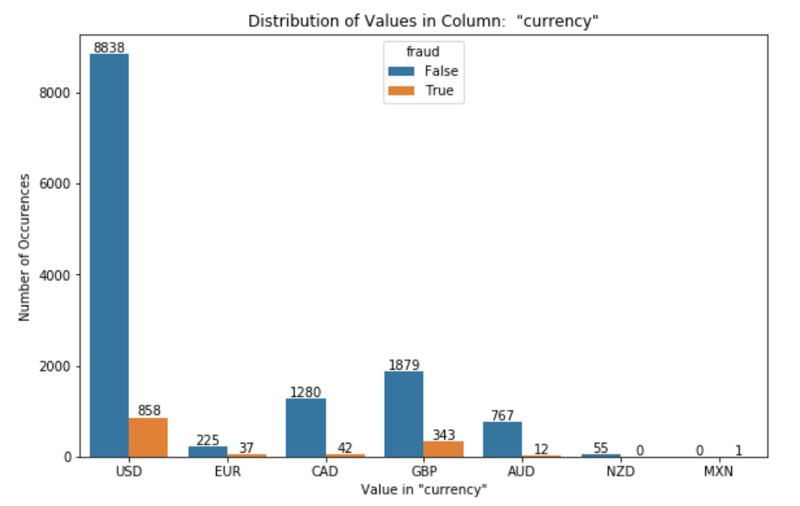

# Fraud Detection Classifier

Online ticket vendors offer the convenience of digital tickets without the expense of building an online sale platform. As intermediaries, these vendors are particularly reliant on convenience factor; their service must be easy and secure. There are few things less convenient than getting scammed. **Fraud detection is a growing application of machine learning**, and is a vital security measure across a range of industries.

This repo explores the ways to **customize fraud detection classification models for use in the ticket vendor industry**. Because we utilize real data from a ticket sales company, some segments of the work posted here will not be reproducible. This is one of several steps taken to ensure the anonymity of the vendor and its clients. 

Also, **please note: this repository is a work in progress**. I am in the process of recreating files to remove all reference to identifiable information. As new sections are completed, I will post files here and update the content list below. 

#### Available for Review
* **EDA**

* **Feature Engineering**

#### In Progress
* Natural Language Processing
  * Process text columns (event & organization descriptions)
      * Remove HTML, punctuation, stop words
      * Tokenize & lemmatize
  * Compare vectorizers: Count, TF-IDF, and Hash
* Model Selection
   * Hyperparameter tuning using Random Search & Grid Search
   * Compare model performance with cross-validation
      * Random Forest
      * Logistic Regression
      * Gradient Boosting
      
